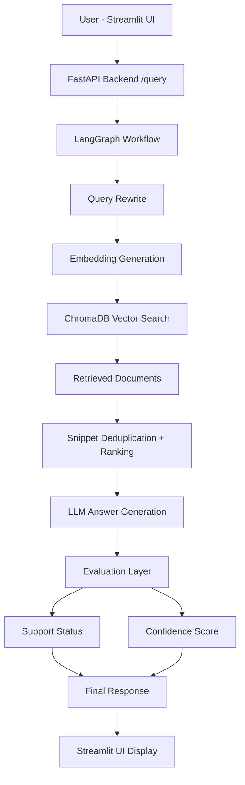

# Healthcare RAG Assistant

A domain-specific AI assistant that uses **Retrieval-Augmented Generation (RAG)** to answer questions over clinical healthcare documents and guidelines.  
The system provides **evidence-backed answers**, improving reliability and interpretability for healthcare-related queries.

---

## Architecture



---


## ⚙️ Tech Stack

| Component | Technology |
|-----------|-----------|
| Language | Python |
| Backend | FastAPI |
| Frontend | Streamlit |
| LLM Orchestration | LangGraph |
| Framework | LangChain |
| Vector Database | ChromaDB |
| Embeddings & LLM | OpenAI API |

---

## Key Features

### Retrieval-Augmented Generation (RAG)
- Semantic search over healthcare documents
- Context-aware retrieval using embeddings

### Query Intelligence
- Query rewriting for improved retrieval quality
- Handles vague and broad clinical questions

### Evidence-Based Responses
- Answers grounded in retrieved documents
- Source citations with page-level references

### Clean Evidence Rendering
- Deduplication of overlapping chunks
- Embedding-based snippet ranking

### Answer Quality Evaluation
**Support Status:**
- Supported
- Partially Supported
- Not Supported

**Confidence Score:**
- High
- Medium
- Low

### Conversational Memory
- Maintains context across follow-up questions using LangGraph

### Structured Output
- Clinical-style formatted answers
- Organized evidence sections:
  - Key Evidence
  - Additional Guidance
  - Safety Notes

---

## Example Queries

- What does the guideline recommend for diabetes?
- Summarize key recommendations from this document
- When should statin therapy be initiated?
- What are LDL-C targets for high-risk patients?
- At what level is Lp(a) considered elevated?

---

## Project Structure

```
healthcare-rag-assistant/
│
├── app/
│   ├── api/
│   ├── agents/
│   ├── core/
│
├── frontend/
│   └── streamlit_app.py
│
├── data/
├── requirements.txt
└── README.md
```

---

## How to Run

**1. Clone the repository**
```bash
git clone https://github.com/YOUR_USERNAME/healthcare-rag-assistant.git
cd healthcare-rag-assistant
```

**2. Create virtual environment**
```bash
python -m venv venv
venv\Scripts\activate   # Windows
```

**3. Install dependencies**
```bash
pip install -r requirements.txt
```

**4. Add OpenAI API Key**

Create a `.env` file:
```
OPENAI_API_KEY=your_api_key_here
```

**5. Run backend**
```bash
uvicorn app.main:app --reload
```

**6. Run frontend**
```bash
streamlit run frontend/streamlit_app.py
```

---

## System Workflow

1. **Upload Document** — Clinical guideline PDFs are uploaded and processed
2. **Chunking & Embedding** — Text is split into chunks and embedded
3. **Query Processing** — User query is rewritten for better retrieval
4. **Retrieval** — Relevant chunks retrieved using ChromaDB
5. **Ranking & Deduplication** — Best snippets selected using embedding similarity
6. **Answer Generation** — LLM generates structured response
7. **Evaluation** — Support status and confidence are computed
8. **UI Rendering** — Answer + evidence displayed to user

---

## Current Status

- Fully functional RAG system
- Multi-document support
- Query rewriting
- Snippet ranking + deduplication
- Evidence-backed answers
- Confidence + support evaluation
- Clean UI with structured outputs

---

## 🚧 Future Improvements

- Patient-specific clinical reasoning (decision support)
- Guideline strength extraction (Class I / IIa / IIb)
- Inline citations at sentence level
- Multi-guideline comparison
- Export results as PDF reports
- Document-type aware retrieval

---

## Use Cases

- Clinical guideline exploration
- Medical education
- Healthcare AI prototyping
- Evidence-based decision support systems

---

## Author

**Sanjay D P**  
Master's in Data Science & Artificial Intelligence  
Data Engineer

---

## Final Note

This project demonstrates the application of modern AI systems (RAG + LLMs) to healthcare — focusing on **accuracy**, **explainability**, and **usability**.
