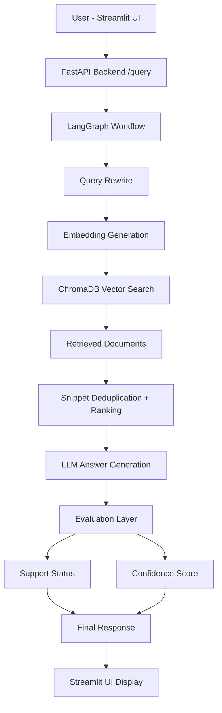

# Healthcare RAG Assistant

A domain-specific AI assistant that uses **Retrieval-Augmented Generation (RAG)** to answer questions over clinical healthcare documents and guidelines.  
The system provides **evidence-backed answers**, improving reliability and interpretability for healthcare-related queries.

---

## Architecture

---
